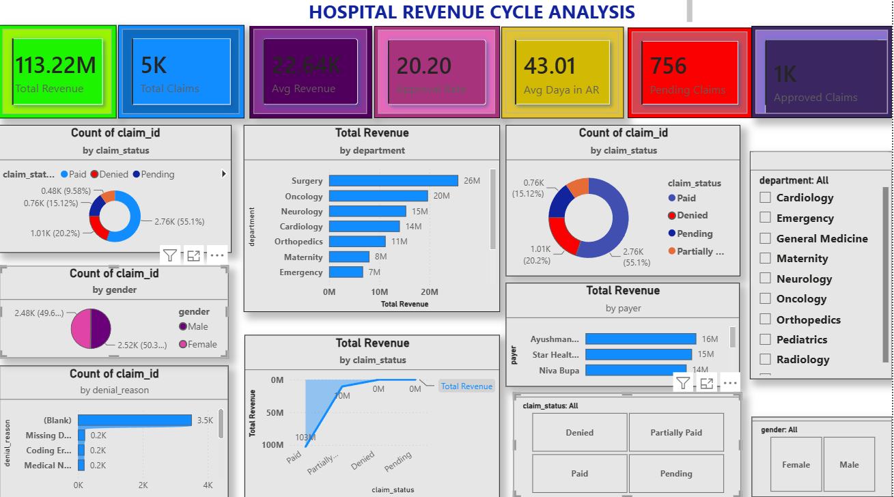
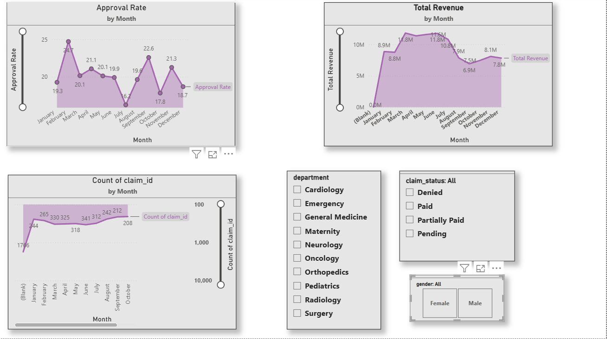

🏥 Hospital Revenue Cycle Analysis Dashboard

📌 Project Overview

This project focuses on analyzing Hospital Revenue Cycle Management (RCM) performance using Power BI. The dashboard provides insights into revenue generation, claims processing, approval rates, pending claims, payer performance, and departmental revenue contributions.

The objective is to help healthcare organizations monitor financial performance, improve claim management efficiency, and identify areas for revenue optimization.

---

🛠️ Tools Used

- Power BI
- SQL
- Microsoft Excel

---

📊 Key KPIs

- Total Revenue: 113.22M
- Total Claims: 5K
- Approval Rate: 20.20%
- Average Days in AR: 43.01
- Pending Claims: 756
- Approved Claims: 1K

---

📈 Dashboard Features

Executive Dashboard
- Total Revenue Analysis
- Claims Overview
- Approval Rate Monitoring
- Pending Claims Tracking
- Department-wise Revenue Analysis
- Payer-wise Revenue Analysis

Claims Analysis Dashboard
- Claims by Status
- Claims by Gender
- Revenue by Procedure Type
- Revenue by Claim Status
- Department Filters
- Procedure Filters

 Revenue Analysis Dashboard
- Monthly Revenue Trends
- Monthly Approval Rate Trends
- Monthly Claims Trends
- Interactive Department Filters
- Interactive Claim Status Filters

---

🔍 Business Insights

- Surgery department generated the highest revenue.
- Paid claims contributed the largest share of total claims.
- Pending claims indicate opportunities for process improvement.
- Average Days in AR helps monitor revenue collection efficiency.
- Revenue trends can be tracked monthly for better decision-making.

---

📂 Project Structure

```text
hospital-revenue-cycle-analysis
│
├── Dashboard
│   └── Hospital_Revenue_Cycle_Analysis.pbix
│
├── Dataset
│   └── hospital_revenue_dataset.xlsx
│
├── Screenshots
│   ├── Executive_Dashboard.png
│   ├── Claims_Analysis.png
│   └── Revenue_Analysis.png
│
└── README.md
```

---

📸 Dashboard Screenshots






🎯 Skills Demonstrated

- Data Cleaning
- Data Modeling
- DAX Measures
- KPI Development
- Interactive Dashboard Design
- Data Visualization
- Healthcare Data Analytics
- Business Intelligence Reporting

---

👤 Author

Srinath M

Aspiring Healthcare Data Analyst | Power BI | SQL | Excel
